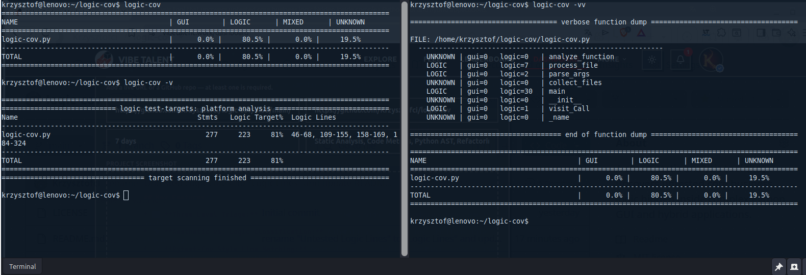

# logic-cov

`logic-cov` (Logic Coverage) is a pragmatic static analysis tool designed to uncover untested core business logic hidden inside complex Python GUI and hybrid applications. 

Traditional coverage tools like `pytest-cov` only measure **execution path coverage**—they tell you which lines of code were interpreted during a test run, but they cannot distinguish between UI layout boilerplate and critical backend operations. This often leads to a "false 100% coverage trap," where your GUI components are loaded into memory, but your critical data processing remains untested.

`logic-cov` solves this by analyzing the Abstract Syntax Tree (AST) of your codebase to calculate **Target Density** and pinpoint exactly where your pure Python logic resides. By filtering out the noise of UI widget configurations (`pack`, `grid`, `bind`, etc.), it generates a surgical roadmap of precisely which line numbers contain untested, test-worthy business logic.

---

## Key Features

* 📊 **Three Level Triage:** Switch seamlessly from a high-level codebase overview to a dedicated coverage-style line report or an ultra-detailed per-function analysis.
* 🎯 **Aesthetic vs. Logic Classification:** Automatically classifies functions into `GUI`, `LOGIC`, `MIXED`, or `UNKNOWN` using semantic weighting and keyword clustering.
* 🩺 **Pytest-Cov Style Line Matching:** Generates clear, tabular terminal reports that list exact line-number ranges (`Untested Logic Lines`) so you know exactly where to write your next unit test.
* 🚀 **Zero Configuration & Zero Dependencies:** Built entirely on top of Python's native `ast` and `pathlib` modules. No heavy external servers, Docker containers, or complex CI pipelines required.

---

## How It Works Under the Hood

The tool statically parses your `.py` files without executing them. It utilizes Python's `ast.NodeVisitor` to inspect:
1. **Function Names:** Functions containing keywords like `build_`, `show_`, or `ui_` gain GUI weight, while `calc_`, `parse_`, or `load_` gain Logic weight.
2. **Function Calls:** Internal method invocations (e.g., calling `.grid()`, `.pack()`, or instantiating widgets like `ttk.Notebook`) are treated as GUI indicators. System and file operations (e.g., using `json`, `subprocess`, `os`, `re`, or `open`) shift the weight toward Logic.

### Architectural Scoring Heuristics
A mathematical ratio determines final category assignments:
* **UNKNOWN:** Total weight score is exactly `0` (typically empty methods, raw properties, or abstract definitions).
* **GUI / LOGIC:** One type heavily dominates the other by a factor of at least $1.5\times$ (or one score is completely `0`).
* **MIXED:** High scores on both sides that fail to satisfy the $1.5\times$ threshold margin, signaling tight coupling between the UI and logic.

---

## CLI Usage

`logic-cov` is designed to be plug-and-play. It automatically scans the `scripts/` directory for Python files and offers three levels of granularity depending on your current objective.



Run the tool from your project root directory:

```bash
python3 logic-cov.py [flags]


1. Defaut mode (Codebase Summary Overview):
Command: python3 logic-cov.py

Best for a quick, high-level health check of your codebase architecture. It outputs a clean, compact table showing the percentage distribution of code categories based on function body lengths, concluded by a global codebase summary.

Example Sample Output:
===============================================================================================
NAME                                     | GUI        | LOGIC      | MIXED      | UNKNOWN   
===============================================================================================
glava-gui.py                             |     58.0% |     26.0% |     14.3% |      1.8%
gui/colors.py                            |      0.0% |     92.5% |      0.0% |      7.5%
gui/modules/base.py                      |     60.4% |     13.3% |      0.0% |     26.3%
gui/widgets.py                           |     25.8% |     14.4% |     35.1% |     24.7%
-----------------------------------------------------------------------------------------------
TOTAL                                    |     49.5% |     34.9% |      3.7% |     11.9%
===============================================================================================

2. Verbose mode -v (Logic Coverage Report):
Command: python3 logic-cov.py -v

Modeled after pytest-cov, this is your primary testing roadmap. It displays Target Density (Target%), showing what percentage of your functions contain test-worthy backend logic, along with the exact physical file line numbers where they live.

Example Output:
===============================================================================================
============================ logic test-targets: platform analysis ============================
Name                                            Stmts   Logic Target%  Logic Lines
-----------------------------------------------------------------------------------------------
glava-gui.py                                     1066     429     40%  76-95, 98-101, 148-179, 186-216, 371-375, 377-386, 489-530, 532-583, 715-719, 721-725, 762-764, 766-793, 799-800, 892-1000, 1001-1010, 1021-1033, 1053-1110
gui/__init__.py                                     0       0      0%  
gui/color_button.py                               213      92     43%  30-75, 138-146, 160-170, 237-245, 253-269
gui/colors.py                                     173     160     92%  32-56, 58-102, 104-122, 124-135, 138-164, 167-198
gui/core.py                                       117     107     91%  81-87, 90-93, 96-99, 102-105, 112-121, 124-127, 134-143, 146-152, 159-168, 171-181, 188-195, 198-201, 219-228, 231-234, 237-239, 242-248
gui/geometry.py                                   157     157    100%  37-46, 49-86, 89-122, 129-171, 178-193, 196-211
gui/glava.py                                      375     333     89%  26-28, 31-38, 41-53, 56-63, 66-77, 109-113, 115-119, 121-142, 152-195, 198-236, 248-276, 283-286, 289-291, 299-317, 320-325, 332-346, 349-368, 371-379, 382-428, 431-444, 447-454
gui/instance.py                                   113      98     87%  25-32, 37-38, 41-42, 44-45, 47-48, 50-51, 54-55, 58-59, 63-66, 72-90, 138-143, 155-170, 172-176, 178-190, 199-211
gui/instance_tab_bar.py                           359      13      4%  363-370, 372-376
gui/modules/__init__.py                             0       0      0%  
gui/modules/bars.py                               242      49     20%  81-90, 284-295, 299-304, 306-322, 324-327
gui/modules/base.py                               445      59     13%  88-92, 294-322, 351-355, 358-362, 365-369, 372-376, 379-383
gui/modules/circle.py                             282      36     13%  73-87, 184-186, 319-322, 324-326, 335-345
gui/modules/glsl_io.py                            273     233     85%  16-19, 26-44, 47-71, 78-96, 99-121, 128-143, 146-156, 159-162, 165-175, 182-201, 204-224, 231-241, 244-253, 256-263, 266-276, 279-288, 324-333
gui/modules/graph.py                              180      40     22%  59-71, 217-222, 224-233, 235-245
gui/modules/radial.py                             363      33      9%  94-107, 410-413, 415-417, 419-430
gui/modules/wave.py                               290      30     10%  62-73, 207-209, 351-353, 355-366
gui/tab_advanced.py                               527     108     20%  377-383, 385-393, 395-414, 416-422, 433-463, 475-477, 481-496, 502-516
gui/tab_main.py                                   668     271     41%  83-88, 294-300, 302-310, 322-343, 357-361, 363-397, 398-429, 440-442, 554-562, 564-580, 590-596, 598-606, 608-613, 615-618, 620-622, 624-627, 629-637, 639-692, 698-719, 739-742, 743-746
gui/tab_module.py                                 124      60     48%  66-81, 98-131, 138-147
gui/theme.py                                       54       6     11%  146-148, 188-190
gui/themes/__init__.py                              0       0      0%  
gui/widgets.py                                     97      48     49%  11-44, 101-102, 104-108, 110-116
-----------------------------------------------------------------------------------------------
TOTAL                                            6118    2362     39%
===============================================================================================
=================================== target scanning finished ==================================


3. Double Verbose Mode -vv (Deep Function Dump)
Command: python3 logic-cov.py -vv

The ultimate debugging mode. It performs a deep static inspection and dumps every single function found in your files. For each function, it displays its architectural classification along with its exact heuristic scoring weights (gui= and logic=), followed by the default summary table.

Example Output:
FILE: /home/cymes/bing-glava-suite/scripts/gui/widgets.py
  ------------------------------------------------------------
    MIXED   | gui=7   logic=5   | _ensure_shift_style
    GUI     | gui=9   logic=0   | __init__
    UNKNOWN | gui=0   logic=0   | _fmt
    UNKNOWN | gui=0   logic=0   | _on_cmd
    UNKNOWN | gui=0   logic=0   | _on_release
    UNKNOWN | gui=0   logic=0   | _on_entry
    LOGIC   | gui=0   logic=2   | get
    LOGIC   | gui=0   logic=2   | set
    LOGIC   | gui=1   logic=2   | set_range

===================================== end of function dump ====================================

===============================================================================================
NAME                                     | GUI        | LOGIC      | MIXED      | UNKNOWN   
===============================================================================================
glava-gui.py                             |     58.0% |     26.0% |     14.3% |      1.8%
gui/__init__.py                          |      0.0% |      0.0% |      0.0% |      0.0%
gui/color_button.py                      |     48.8% |     26.8% |     16.4% |      8.0%
gui/colors.py                            |      0.0% |     92.5% |      0.0% |      7.5%
gui/core.py                              |      0.0% |     91.5% |      0.0% |      8.5%
gui/geometry.py                          |      0.0% |    100.0% |      0.0% |      0.0%
gui/glava.py                             |      0.0% |     88.8% |      0.0% |     11.2%
gui/instance.py                          |      0.0% |     86.7% |      0.0% |     13.3%
gui/instance_tab_bar.py                  |     74.1% |      2.2% |      1.4% |     22.3%
gui/modules/__init__.py                  |      0.0% |      0.0% |      0.0% |      0.0%
gui/modules/bars.py                      |     66.9% |     20.2% |      0.0% |     12.8%
gui/modules/base.py                      |     60.4% |     13.3% |      0.0% |     26.3%
gui/modules/circle.py                    |     74.5% |     12.8% |      0.0% |     12.8%
gui/modules/glsl_io.py                   |     14.7% |     85.3% |      0.0% |      0.0%
gui/modules/graph.py                     |     75.6% |     22.2% |      0.0% |      2.2%
gui/modules/radial.py                    |     74.7% |      9.1% |      0.0% |     16.3%
gui/modules/wave.py                      |     69.7% |     10.3% |      0.0% |     20.0%
gui/tab_advanced.py                      |     72.3% |     20.5% |      0.0% |      7.2%
gui/tab_main.py                          |     40.1% |     40.6% |      0.0% |     19.3%
gui/tab_module.py                        |     24.2% |     48.4% |      0.0% |     27.4%
gui/theme.py                             |     83.3% |     11.1% |      0.0% |      5.6%
gui/themes/__init__.py                   |      0.0% |      0.0% |      0.0% |      0.0%
gui/widgets.py                           |     25.8% |     14.4% |     35.1% |     24.7%
-----------------------------------------------------------------------------------------------
TOTAL                                    |     49.5% |     34.9% |      3.7% |     11.9%
===============================================================================================


4. Dynamic Comparison Mode -comp (Pytest Integration Gap Analysis)
Command: logic-cov tests/ scripts/ -comp

This mode bridges static tree parsing with dynamic test metrics. It intersects the lines identified by logic-cov as pure backend business logic (LOGIC/MIXED) with the actual unexecuted lines reported by pytest.

Instead of showing absolute static targets, it calculates real-time Logic Coverage % and injects an intelligent syntax padding around the missing lines (e.g., automatically preserving parent control structures like if, for, or try), giving AI models the perfect contextual prompt needed to write missing test cases.

====================================================================================
====================== logic-cov: Logic Coverage Gap Analysis ======================
Name                                     Logic Stmts    Covered    Missing  Logic Cover%
------------------------------------------------------------------------------------
scripts/glava-gui.py                             429          0        429            0%
  ↳ Missing Logic: 76-95, 98-101, 148-179, 186-216, 371-375, 377-386, 489-530, 532-583, 715-719, 721-725, 762-764, 766-793, 799-800, 892-1010, 1021-1033, 1053-1110
scripts/gui/__init__.py                            0          0          0          100%
scripts/gui/color_button.py                       92          7         85            8%
  ↳ Missing Logic: 37-75, 138-146, 160-170, 237-245, 253-269
scripts/gui/colors.py                            160        160          0          100%
scripts/gui/core.py                              107        107          0          100%
scripts/gui/geometry.py                          157        153          4           97%
  ↳ Missing Logic: 116-119
scripts/gui/glava.py                             333        237         96           71%
  ↳ Missing Logic: 35-38, 60-63, 131-142, 177-179, 223-233, 264-276, 283-286, 304-306, 320-325, 354-356, 364-367, 371-379, 387-389, 418-420, 431-444
scripts/gui/instance.py                           98         98          0          100%
scripts/gui/instance_tab_bar.py                   13          9          4           69%
  ↳ Missing Logic: 367-370
scripts/gui/modules/__init__.py                    0          0          0          100%
scripts/gui/modules/bars.py                       49         49          0          100%
scripts/gui/modules/base.py                       59         59          0          100%
scripts/gui/modules/circle.py                     36         16         20           44%
  ↳ Missing Logic: 184-186, 319-322, 324-326, 335-344
scripts/gui/modules/glsl_io.py                   233        233          0          100%
scripts/gui/modules/graph.py                      40         14         26           35%
  ↳ Missing Logic: 217-222, 224-233, 235-244
scripts/gui/modules/radial.py                     33         15         18           45%
  ↳ Missing Logic: 410-413, 415-417, 419-429
scripts/gui/modules/wave.py                       30         13         17           43%
  ↳ Missing Logic: 207-209, 351-353, 355-365
scripts/gui/tab_advanced.py                      108         34         74           31%
  ↳ Missing Logic: 381-383, 390-393, 409-411, 433-463, 475-477, 481-496, 502-515
scripts/gui/tab_main.py                          249        168         81           67%
  ↳ Missing Logic: 293-299, 301-309, 339-373, 552-555, 600-603, 605-613, 645-647, 656-659, 679-681, 691-693
scripts/gui/tab_module.py                         60         60          0          100%
scripts/gui/theme.py                               6          3          3           50%
  ↳ Missing Logic: 188-190
scripts/gui/themes/__init__.py                     0          0          0          100%
scripts/gui/widgets.py                            48          0         48            0%
  ↳ Missing Logic: 11-44, 101-102, 104-108, 110-116
------------------------------------------------------------------------------------
TOTAL LOGIC                                     2340       1435        905           61%
====================================================================================
============================= target analysis finished =============================
